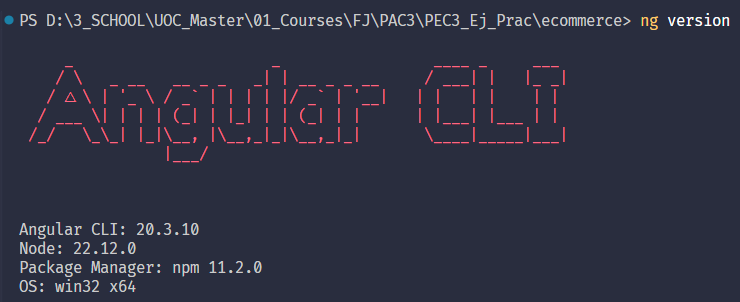

# PAC 3 – Frameworks: Introducció a Angular i formularis

## Informació de l’alumne

**Login UOC:** adiazrom26@uoc.edu

**Nom i cognoms:** Alba Diaz Romero

---

## Descripció general

En aquesta PAC s’ha desenvolupat una aplicació inicial amb **Angular**. S’han realitzat diverses pràctiques relacionades amb la creació de components, gestió de formularis i directrius Angular. Durant el procés s’han abordat problemes de vinculació de components i gestió de propietats, així com la integració de formularis reactius i templates.

## Notes generals

- Es recomana tenir instal·lat **Node.js** i **Angular CLI** segons la versió indicada al web oficial: [Angular CLI](https://angular.io/cli).
- Els projectes es poden executar amb `ng serve` dins de la carpeta del projecte.
- Les imatges utilitzades en l’aplicació es troben dins de la carpeta `assets/img`.
- S’ha fet ús de **standalone components**, **ChangeDetectionStrategy.OnPush**, i **formularis reactius**.
- Qualsevol missatge d’error en executar el projecte pot estar relacionat amb dependències no instal·lades; en aquest cas, executar `npm install`.

---

## Exercici 1: Instal·lació, configuració de l’Angular CLI i “Hola Món”

Aquest exercici consistia en instal·lar i configurar **Angular CLI** al meu equip, crear un projecte Angular anomenat **ecommerce** dins la carpeta `PEC3_Ej_Prac` i implementar una aplicació bàsica que mostri “Hola Món”.

### Passos realitzats

1. **Instal·lació** de **Node.js** i **Angular CLI**.

2. **Creació de la carpeta** `PEC3_Ej_Prac`.
3. **Inicialització del projecte Angular** amb:
   ```bash
   ng new ecommerce
   ```
4. Afegit **control de versions amb Git**:
   ```bash
   git init
   git add .
   git commit -m "Missatge commit"
   ```
5. Executat el projecte per comprovar la correcta visualització de “Hola Món”:
   ```bash
   ng serve
   ```

### Dificultats i millores

- Al principi hi havia problemes amb la compatibilitat de versions de Node i Angular CLI.
- S’ha organitzat la carpeta assets per a imatges i recursos.
- S’ha configurat SCSS com a preprocesador per poder fer estils modulars i mantenibles.
- S’ha implementat un README.md per documentar totes les passes i facilitar la revisió.

## Exercici 2: Primer component a Angular

Crear un component que mostri la informació d’un únic article, amb botons per incrementar i decrementar la quantitat seleccionada per l’usuari.

### Passos realitzats

1. **Creació del component `article-item`**  
   S’ha creat el component amb Angular CLI:
   ```bash
   ng generate component components/article-item --standalone
   ```
2. **Definició del model Article**
   S’ha creat una interfície Article a src/app/models/article.model.ts
3. **Implementació del component ``article-item``**
   - Mostra el nom de l’article, la imatge, el preu, si està en venda i la quantitat comprada.
   - Si l’article està en venda (`isOnSale = true`), el card es ressalta amb un color diferent.
   - La quantitat seleccionada es mostra en temps real.
   - Es poden incrementar i decrementar les unitats amb botons, i el botó de decrement està desactivat si la quantitat és 0.

### Dificultats i comentaris

- S’ha hagut de gestionar correctament l’actualització en temps real de la quantitat de productes seleccionats.
- La condició [``ngClass``] permet aplicar estils diferents si l’article està en venda o no.
- Es van configurar botons amb disabled per evitar quantitats negatives.
- Aquest component servirà de base per a la creació de la llista d’articles en els exercicis següents.

### Consideracions per a la correcció

- Angular CLI ha d’estar instal·lat correctament (``ng version``).
- El projecte ecommerce ha de poder iniciar-se amb:
  ```bash
  ng serve
  ```

## Exercici 3: Directives al nostre projecte

Aplicar **directives Angular** per modificar dinàmicament l’estil i la visualització dels elements del component `article-item`.

### Passos realitzats

1. **Ús de la directiva `ngClass`**
   - El preu de l’article canvia de color segons la disponibilitat:
     - Si l’article **està a la venda** (`isOnSale = true`), el preu apareix normal.
     - Si l’article **no està a la venda**, el preu es mostra en gris.
   - Implementació al template:
   ```html
   <p [ngClass]="{'not-for-sale': !article.isOnSale}" class="price">\${{ article.price }}</p>
   ```
2. **Ús de la directiva d’estructura** ``*ngIf``

   - Els botons d’incrementar i decrementar, així com la visualització de la quantitat seleccionada, només apareixen si l’article està disponible ``(isOnSale = true)``.

3. **Resultat**
   - Els articles disponibles per a la venda mostren tots els controls i estil normal.
   - Els articles no disponibles mostren el preu en gris i no mostren els botons ni la quantitat.

### Dificultats i comentaris

- Inicialment, l’estil no canviava correctament perquè calia combinar ngClass amb el CSS corresponent (.not-for-sale { color: gray; }).

- La directiva *ngIf ha permès controlar la visibilitat dels controls sense necessitat d’altres condicions lògiques al component.

## Exercici 4: Components al nostre projecte
Crear un **component pare (`article-list`)** que mostri una llista d’articles i un **component fill (`article-item`)** que representi cada article individualment, amb gestió de quantitats i comunicació entre components.

### Passos realitzats

1. **Creació del component `article-list`**
   - Conté un array de **3 articles** inicialitzats:
     - 2 articles **disponibles per a la venda**
     - 1 article **no disponible**
   - Es mostra la llista completa d’articles quan s’inicia l’aplicació.
   - Implementa **directiva `*ngFor`** per generar un `article-item` per a cada article.
   - Templates i estils en línia (`inline template` i `inline styles`) generats amb Angular CLI.

2. **Modificació del component ``article-item``**
    - Rep un Article com a input.
    - Emite un objecte ArticleQuantityChange amb l’article i la quantitat seleccionada quan es decremente o s’incrementa.
    - Estratègia de ChangeDetection modificada a OnPush per millorar rendiment i evitar rendiments innecessaris.

3. **Gestió de quantitats dins de ``article-list``**
    - La lògica d’incrementar i decrementar la quantitat d’un article s’ha mogut de article-item a article-list.
    - Es fa servir id de l’article per identificar-lo i actualitzar la seva quantitat.

4. **Resultat**
    - La llista mostra correctament tots els articles, amb els articles no disponibles mostrant preu en gris i sense controls de quantitat.
    - Els controls d’incrementar i decrementar funcionen només per als articles disponibles.

## Exercici 5: Repàs de components
Crear un **component de navegació (`navbar`)** i controlar la visualització dels components segons l’opció seleccionada.

### Passos realitzats

1. **Creació del component `navbar`**
    - Menú amb les opcions:
        - Inici
        - Articles
        - Nou article template
        - Nou article reactiu
    - El component emet events mitjançant **`@Output() navigate`** quan es fa clic sobre una opció.
    - El component `App` escolta aquest event i mostra la vista corresponent amb **`*ngIf`**.

2. **Gestió de vistes dins del component App**
    - Inicialment, es mostra article-list per defecte.
    - Quan l’usuari selecciona “Inici” o “Articles”, es mostra de nou article-list.
    - Quan l’usuari selecciona “Nou article template”, es mostra article-new-template i s’amaguen els altres components.
    - Quan l’usuari selecciona “Nou article reactiu”, es mostra article-new-reactive i s’amaguen els altres components.

3. **Estil i posició**
    - S’ha mantingut el navbar a la part superior.
    - La marca està alineada a l’esquerra i les opcions del menú a la dreta.
    - Els components es mostren un al costat de l’altre amb un espai clar entre la capçalera i el contingut.
    - S’ha aplicat Bootstrap per millorar l’aspecte, encara que no és obligatori.

4. **Resultat**
    - La navegació entre les diferents vistes funciona correctament
    - Els components es mostren i s’amaguen segons l’opció seleccionada sense necessitat de recarregar la pàgina.
    - La gestió de vistes es fa de manera clara i centralitzada a través del component principal App.

### Observacions
- S’ha utilitzat directiva estructural *ngIf per controlar la visualització dels components.
- El component navbar és standalone i reutilitzable.
- La separació visual i funcional del menú facilita futures millores i integració amb Angular Router.

## Exercici 6: Formularis dirigits per template
Crear un component `article-new-template` que permeti afegir nous articles utilitzant **formularis dirigits per template (template-driven forms)**.

### Passos realitzats

1. **Creació del component**
   - Nom del component: `article-new-template`.
   - Es mostra només quan l’usuari selecciona l’opció “Nou article template” al menú.
   - El component conté un **FormGroup** anomenat `article` que encapsula tots els controls del formulari.

2. **Controls del formulari**
   - **Nom de l’article** (`name`) – camp obligatori.
   - **Preu** (`price`) – camp obligatori i numèric.
   - **URL de la imatge** (`imageUrl`) – camp obligatori amb validació per patró (RegEx) que comprova que comenci amb `http://` o `https://`, contingui un nom vàlid i domini de 2-3 caràcters.
   - **En venda** (`isOnSale`) – checkbox opcional.

3. **Validacions**
   - Tots els camps són obligatoris, excepte el checkbox.
   - El camp `price` ha de ser un número vàlid.
   - El camp `imageUrl` ha de complir el patró d’una URL vàlida.
   - Els missatges d’error es mostren només després que l’usuari hagi modificat el camp (`touched`) o després del submit del formulari.

4. **Visualització de missatges d’error**
   - Exemple per al nom de l’article:
    ```html
    <div *ngIf="name.invalid && (name.touched || submitted)">
    <small class="text-danger" *ngIf="name.errors?.required">El nom és obligatori.</small>
    </div>

5. **Enviament del formulari**
    - Quan l’usuari envia el formulari, es comproven les validacions.
    - Les dades de l’article no s’afegeixen a la llista d’articles encara, sinó que es mostren per consola per verificar que s’han recollit correctament.

6. **Resultat**
    - Formulari funcional amb missatges d’error reactius segons les condicions establertes.
    - Es comprova correctament que els camps són obligatoris i que l’URL compleix el patró esperat.
    - La implementació utilitza template-driven forms amb ngModel i ngForm per encapsular els controls dins del FormGroup.

### Observacions
- El component és reusable i es pot integrar amb la vista principal controlada pel navbar.
- S’ha aplicat estilització bàsica per millorar la llegibilitat dels missatges d’error.
- En futures PACs es completarà la funcionalitat per afegir l’article a la llista.

## Exercici 7: Formularis reactius
Crear un component `article-new-reactive` que permeti afegir nous articles utilitzant **formularis reactius (Reactive Forms)** amb validacions bàsiques i customitzades.

### Passos realitzats

1. **Creació del component**
   - Nom del component: `article-new-reactive`.
   - Es mostra només quan l’usuari selecciona l’opció “Nou article reactiu” al menú.
   - Es crea un **FormGroup** anomenat `articleForm` que encapsula tots els controls del formulari.
   - S’utilitza `FormBuilder` per inicialitzar els controls.

2. **Controls del formulari**
   - **Nom de l’article** (`name`) – camp obligatori i amb validació custom (`NameArticleValidator`).
   - **Preu** (`price`) – camp obligatori amb mínim 0,1 €.
   - **URL de la imatge** (`imageUrl`) – camp obligatori amb validació de patró (RegEx) per comprovar que sigui una URL vàlida.
   - **En venda** (`isOnSale`) – checkbox opcional.

3. **Validacions**
   - Tots els camps són obligatoris excepte el checkbox.
   - `price` ≥ 0,1 €.
   - `imageUrl` compleix el patró d’una URL vàlida: ha de començar amb `http://` o `https://`, seguir amb un nom vàlid i tenir un domini de 2-3 caràcters.
   - Validació custom `NameArticleValidator` que retorna error si el nom de l’article és: `Prova`, `Test`, `Mock` o `Fake`.
   - Els missatges d’error es mostren només si el camp ha estat modificat (`touched`) o després d’un submit.

4. **Visualització de missatges d’error**
   Exemple de missatge per al nom de l’article:
    ```html
    <div *ngIf="name.invalid && (name.touched || submitted)">
    <small class="text-danger" *ngIf="name.errors?.required">El nom és obligatori.</small>
    <small class="text-danger" *ngIf="name.errors?.invalidName">Aquest nom no està permès.</small>
    </div>

5. **Enviament del formulari**
    - Quan l’usuari fa submit, es comproven totes les validacions.
    - Les dades es mostren per consola per verificar que s’han recollit correctament.

6. **Resultat**
    - Formulari complet amb validacions reactives.
    - Validació custom per evitar noms prohibits.
    - Missatges d’error reactius segons les condicions establertes.
    - Encapsulament de tot el formulari dins d’un FormGroup.

### Observacions

- El component és reusable i es mostra només quan s’activa des del navbar.

- Es poden millorar els estils i la disposició amb Bootstrap.

- En futures PACs s’implementarà la funcionalitat per afegir l’article a la llista real de l’ecommerce.

## Observacions generals

#### **Entorn i requisits:**  
  El projecte s’ha desenvolupat utilitzant Angular 20 i Angular CLI. Per executar-lo cal tenir instal·lat Node.js i npm. 



#### **Estructura del projecte:**  
  - `article-item`: component per mostrar un article individual. Inclou botons per incrementar i decrementar la quantitat i canvia l’estil si està en venda.  
  - `article-list`: component que mostra la llista completa d’articles i gestiona la lògica de quantitat.  
  - `navbar`: component de navegació que permet canviar entre les diferents vistes de l’aplicació.  
  - `article-new-template`: formulari per crear articles amb formularis dirigits per template.  
  - `article-new-reactive`: formulari reactiu amb validacions i validació custom per noms no permesos.

#### **Dificultats trobades:**  
  - Inicialment els components standalone i l’ús de `*ngIf` i `*ngFor` amb imports de `CommonModule` van donar alguns errors de “not a known element”.  
  - Ajustar estils i centrar elements amb Flexbox, especialment per la barra de navegació i les cartes dels articles.  
  - Validacions de formularis, especialment l’ús de RegEx per validar URLs i la validació custom del nom de l’article.

#### **Consideracions per a la correcció/execució:**  
  - No s'han inclòs les carpetes `node_modules` ni `.angular` al repositori ni en el zip final.  
  - El projecte és standalone, així que tots els components necessaris s'importen explícitament.  
  - Els formularis només mostren les dades per consola.
  - Per veure correctament els estils de les cartes i el navbar, executar l’aplicació amb `ng serve` i obrir-la en un navegador modern.